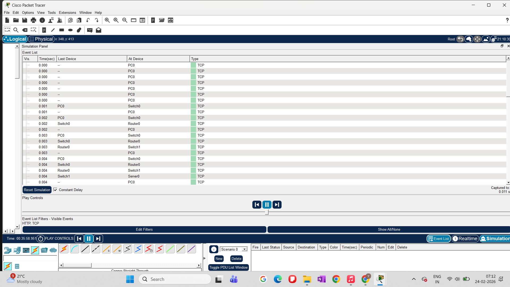
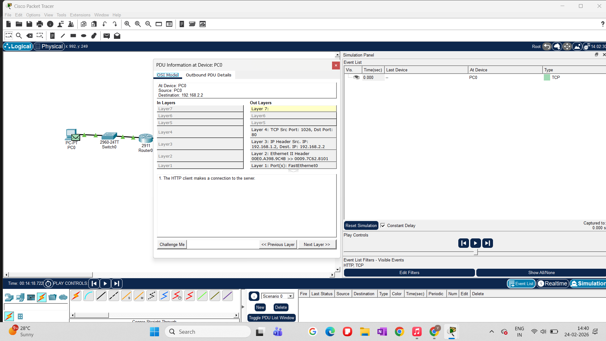
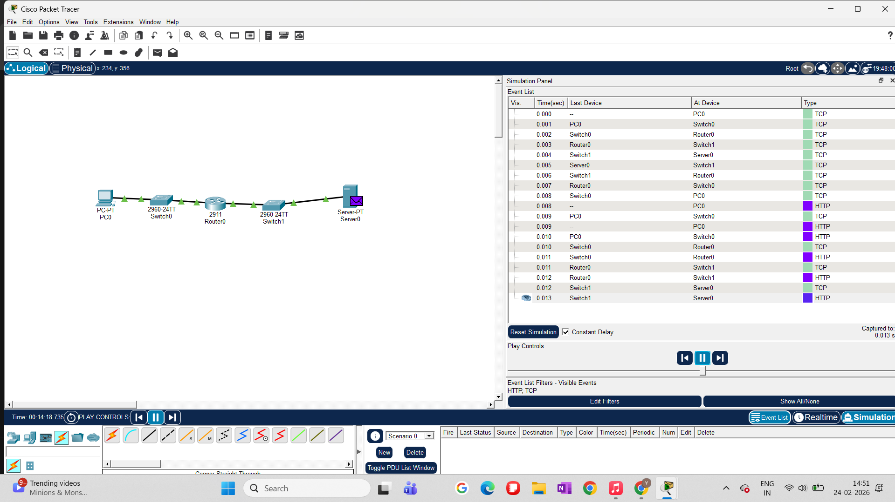
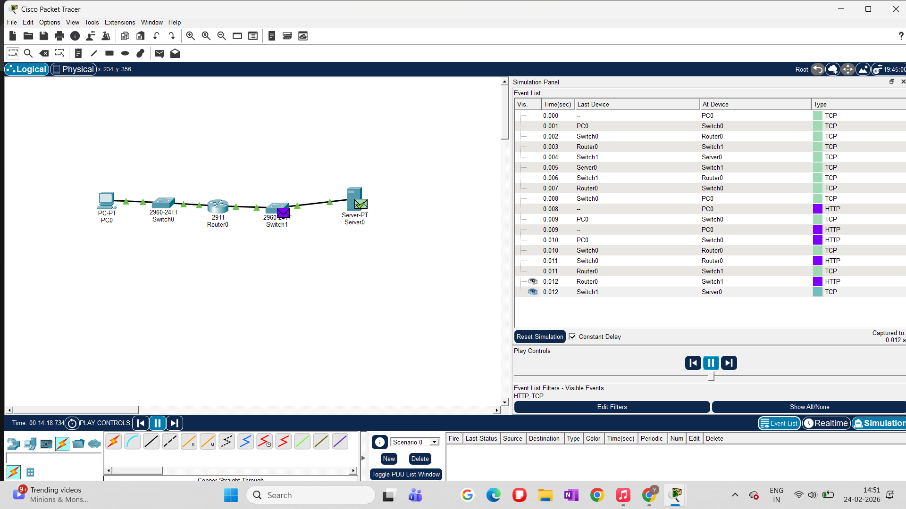
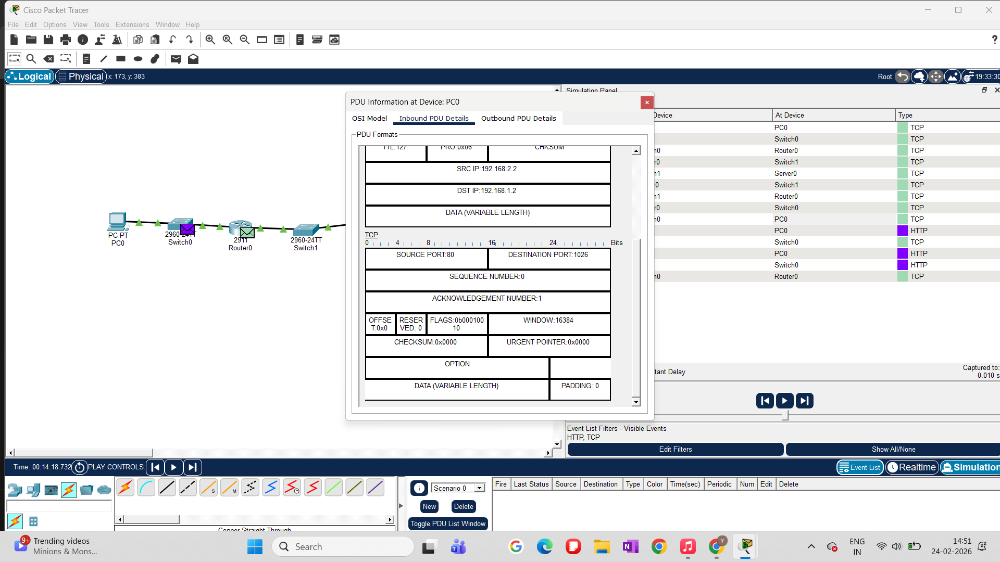
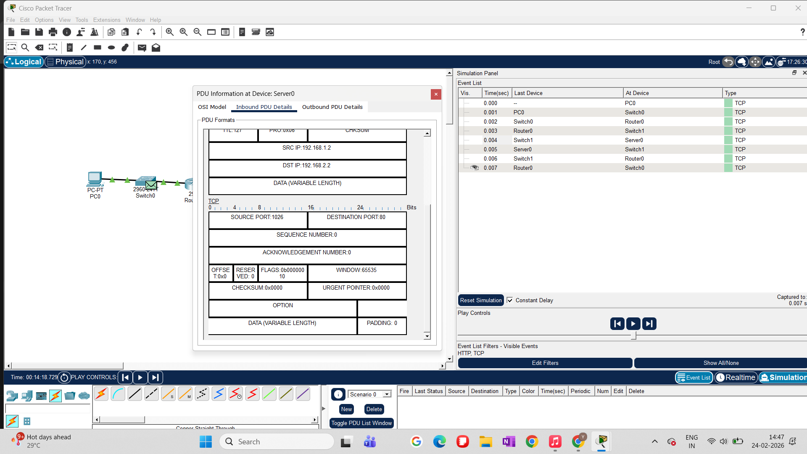
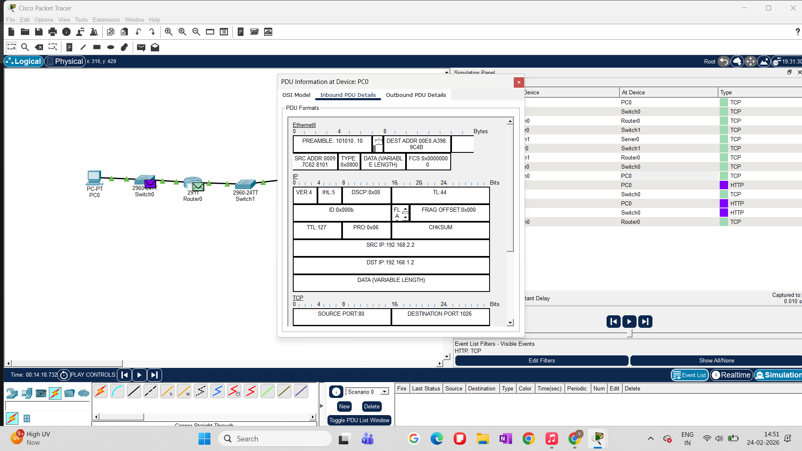
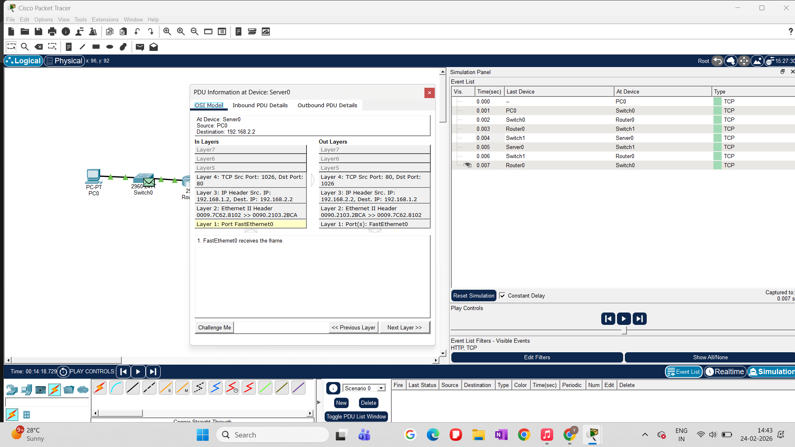
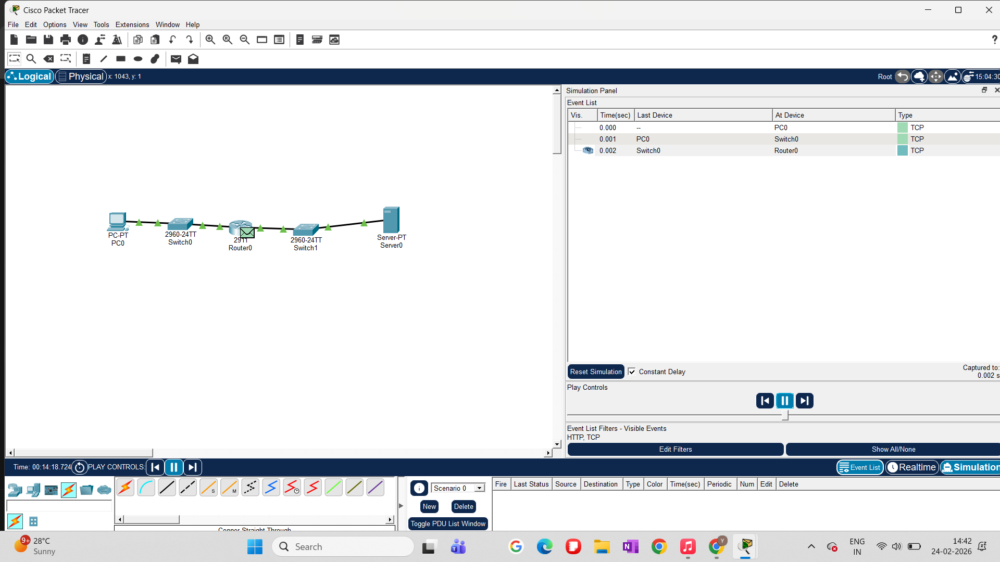

Baseline TCP Performance Analysis (Experiment 1)
1. Introduction

This experiment establishes a baseline understanding of TCP behavior in a simple client–server network using Cisco Packet Tracer.
Before analyzing advanced concepts like congestion control, packet loss, RTT impact, or fairness, it is essential to observe how TCP behaves under ideal conditions — no congestion, no artificial delay, and no packet drops.

The goal of this baseline experiment is to:

Verify correct end-to-end connectivity

Observe TCP connection establishment and data transfer

Analyze TCP and IP header fields at different devices

Understand how HTTP traffic is carried over TCP

This baseline serves as a reference point for all subsequent experiments.

Understand how HTTP traffic is carried over TCP

This baseline serves as a reference point for all subsequent experiments.

2. Experiment Setup and Topology

The network topology consists of:

PC0 acting as the TCP client

Server0 acting as the HTTP server

Two Layer-2 switches and one router connecting different subnets

Key characteristics:

Separate IP networks on either side of the router

Static IP addressing

HTTP service enabled on Server0

Simulation mode enabled to inspect PDUs at each OSI layer

3. Experiment Procedure

The experiment was carried out in the following steps:

Configured IP addresses and default gateways on PC0 and Server0

Verified basic connectivity using ICMP (ping)

Observed initial packet loss during ARP resolution

Confirmed 100% ping success after ARP cache population

Initiated HTTP communication from PC0 to Server0

Switched to Simulation Mode

Tracked TCP and HTTP PDUs across devices

Inspected inbound and outbound PDUs at PC0 and Server0

Examined TCP header fields such as ports, sequence numbers, ACKs, and window size
4. Connectivity Verification

Initial ICMP testing showed:

First ping attempt experienced packet loss due to ARP resolution

Subsequent ping attempts achieved 100% success
Successful Ping Verification

This confirms correct Layer-3 connectivity before proceeding to TCP analysis.

5. TCP Connection Establishment and HTTP Delivery

An HTTP request was generated from PC0 using the Web Browser.
TCP successfully established a connection using:

Ephemeral source port on PC0

Destination port 80 on Server0
Successful HTTP Delivery

This demonstrates proper application-layer communication over TCP.

6. TCP Packet Flow Analysis (End-to-End)

Using Simulation Mode, TCP packets were tracked hop-by-hop:

PC0 → Switch0 → Router0 → Switch1 → Server0

Reverse path for server responses. 

End-to-End TCP Packet Flow

This confirms correct forwarding across Layer-2 and Layer-3 devices.

7. TCP Header and Sequence Analysis

Detailed inspection of TCP headers revealed:

Correct source and destination ports

Proper sequence and acknowledgment numbers

Valid TCP flags (SYN, ACK)

Window size advertisement by receiver
TCP Sequence Number Observation

Detailed TCP Header Fields

8. Inbound PDU Inspection

PDUs were examined at different endpoints to observe encapsulation and decapsulation:

📷 PC0 Inbound PDU

📷 Server0 Inbound PDU

9. Simulation Panel Overview

The Simulation Panel was used to:

Track TCP and HTTP events

Observe packet timing and traversal order

Filter relevant protocol events

📷 Simulation Panel View

10. Key Observations

Initial packet loss was due to ARP resolution, not TCP failure

TCP connection establishment completed successfully

HTTP traffic was reliably delivered over TCP

Sequence numbers and ACKs behaved as expected

No congestion or retransmissions occurred

TCP operated under ideal baseline conditions. 
11. Conclusion

This baseline experiment confirms that TCP functions correctly under normal network conditions with no induced impairments.
All observations from this experiment provide a stable reference for comparing future experiments involving:

Packet loss

Increased RTT

Multiple competing flows

TCP fairness and congestion control behavior. 
