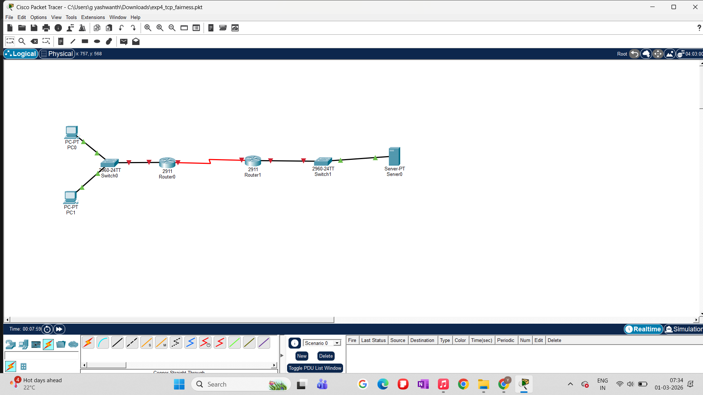
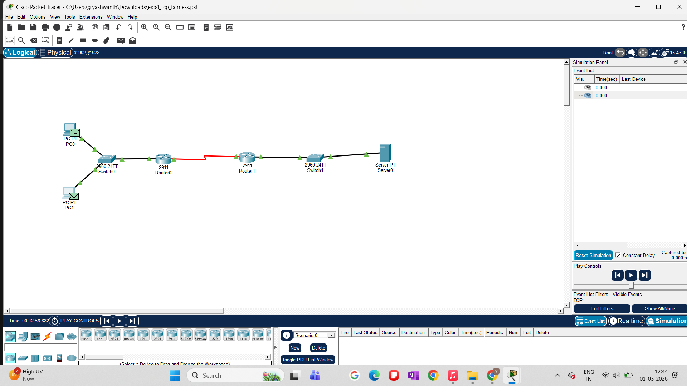
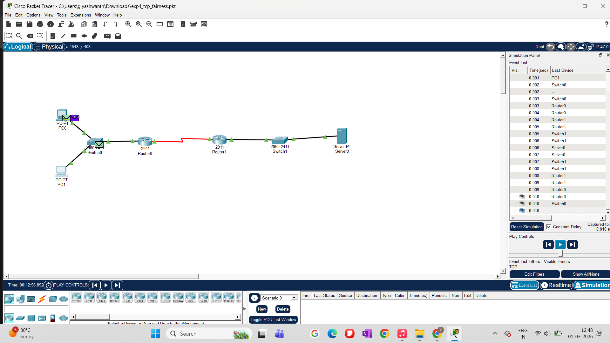
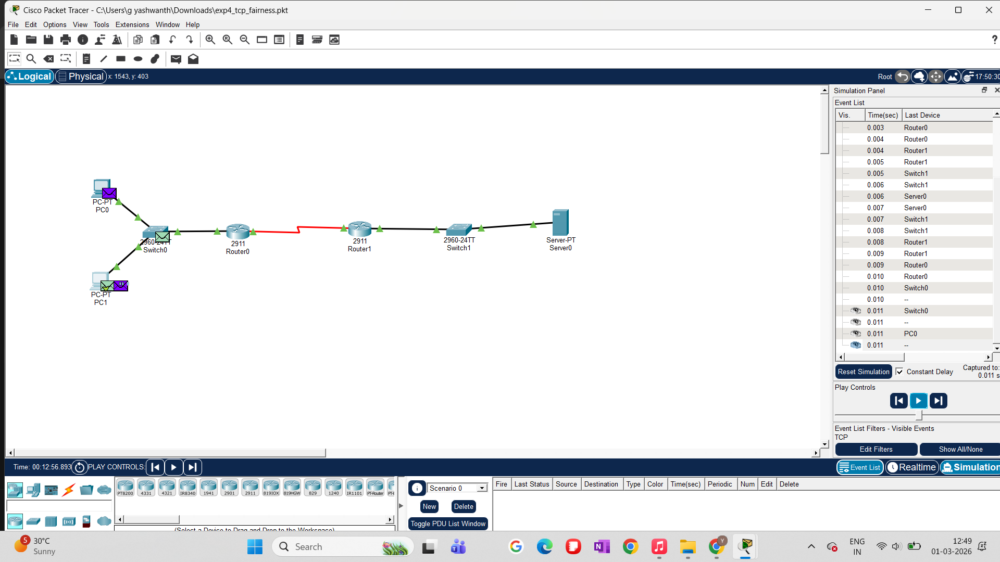
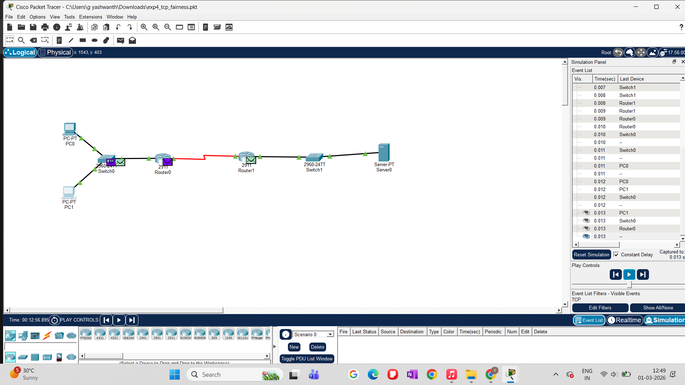

# Experiment 4: TCP Fairness Analysis

## Objective
The objective of this experiment is to study **TCP fairness** when multiple TCP flows share a common bottleneck link.  
Specifically, we analyze whether competing TCP connections obtain a fair share of network resources under congestion, a fundamental property expected from TCP congestion control mechanisms.

---

## Experimental Topology

Two end hosts (PC0 and PC1) simultaneously initiate TCP connections to a common server (Server0).  
Both flows traverse a **shared bottleneck link** between two routers, creating contention.

**Topology Overview:**
- PC0, PC1 → Switch0
- Switch0 → Router0
- Router0 ↔ Router1 (**Serial bottleneck link**)
- Router1 → Switch1 → Server0

---

## Experimental Setup

- **Traffic Type:** HTTP over TCP
- **Senders:** PC0 and PC1
- **Receiver:** Server0
- **Bottleneck:** Serial link between Router0 and Router1
- **Mode:** Simulation Mode (Cisco Packet Tracer)
- **Trigger:** Simultaneous HTTP requests from both PCs

Both clients were configured to access the web service hosted on Server0 at the same time, ensuring concurrent TCP flows.

---

## Experiment Execution

### Step 1: Concurrent Flow Initiation
HTTP requests were triggered simultaneously from PC0 and PC1 to the same destination server.

This guarantees overlapping TCP sessions competing for the same network resources.

---

### Step 2: Bottleneck Observation
Packets from both senders enter the Router0–Router1 serial link, which acts as the congestion point.

This is the critical region where TCP congestion control and fairness behavior emerges.

---

### Step 3: Event List Analysis (Fairness Evidence)
The Simulation Event List was examined to observe packet scheduling across flows.

**Key Observation:**
- Packets from PC0 and PC1 are **interleaved**.
- No single flow monopolizes the bottleneck.
- Packet forwarding alternates between flows within close timestamps.

This behavior reflects TCP’s **AIMD (Additive Increase, Multiplicative Decrease)** fairness property.

---

### Step 4: Packet Delivery at Server
Both flows successfully reach the destination server without starvation.

This confirms that congestion does not block either sender entirely.

---

## Results and Observations

- Multiple TCP flows competing over a shared bottleneck achieve **fair bandwidth sharing**.
- Packet interleaving at the bottleneck demonstrates **flow-level fairness**.
- No persistent bias toward either sender was observed.
- TCP congestion control successfully adapts sending rates under contention.

---

## Discussion

This experiment demonstrates that TCP, even without explicit fairness enforcement, naturally converges toward equitable bandwidth distribution among competing flows.  
The observed interleaving aligns with theoretical TCP behavior studied in congestion control literature.

While Cisco Packet Tracer abstracts several low-level TCP dynamics, it effectively captures:
- Flow competition
- Bottleneck-induced congestion
- Fair resource sharing

These results reinforce TCP’s suitability for shared network environments.

---

## Conclusion

The experiment validates the fairness property of TCP congestion control when multiple flows share a common bottleneck.  
Such behavior is essential for maintaining stability and equitable performance in large-scale networks like the Internet.

---

## Future Extensions

- Introduce **heterogeneous RTTs** to study RTT bias
- Compare fairness between **TCP Reno vs TCP Cubic**
- Introduce background UDP traffic to observe TCP–UDP interaction
- Quantitatively measure throughput per flow

---

## Files Used

- `exp4_tcp_fairness.pkt` – Cisco Packet Tracer simulation file
- Screenshots under `screenshots/` documenting execution and results
