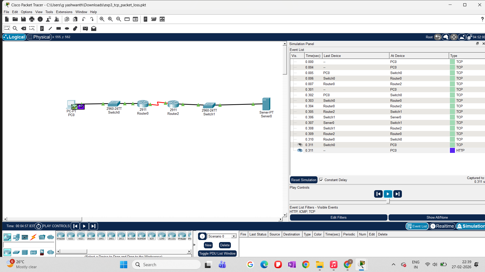
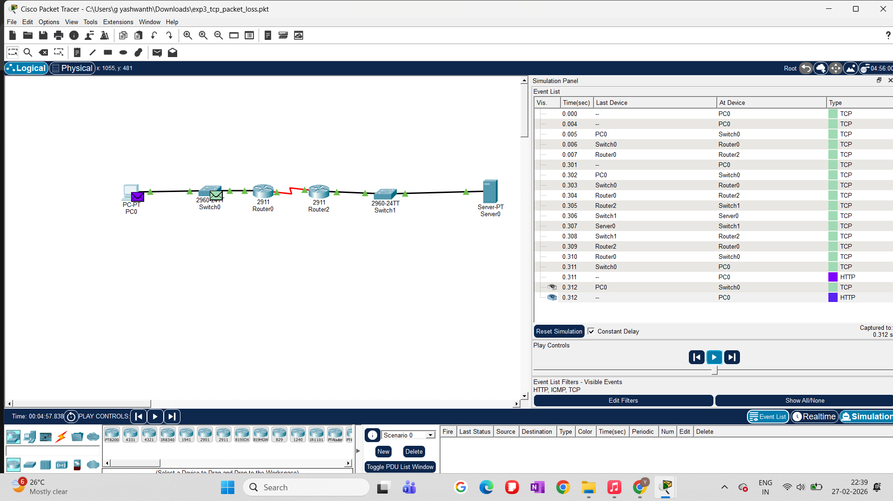
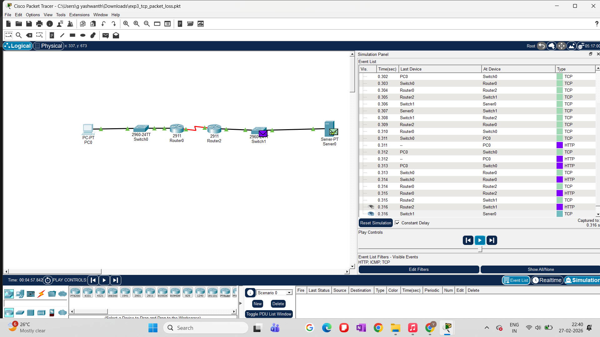
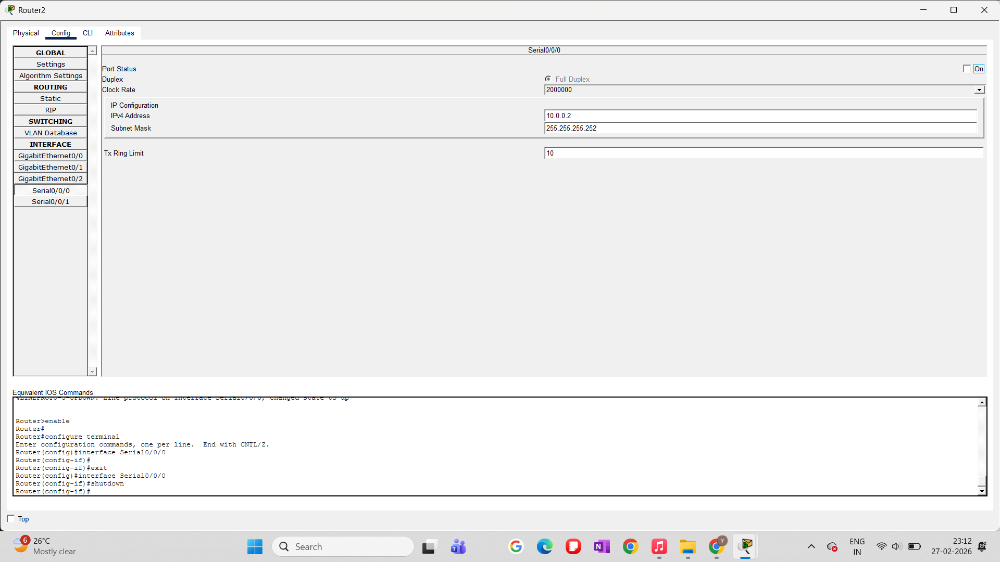
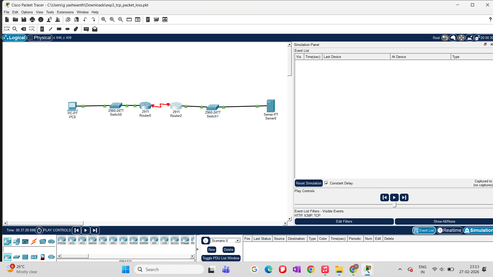
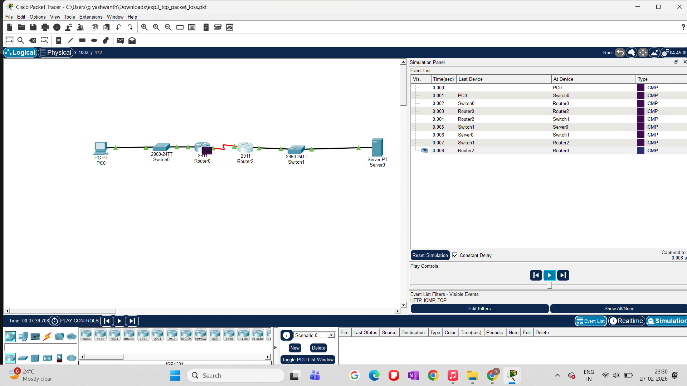
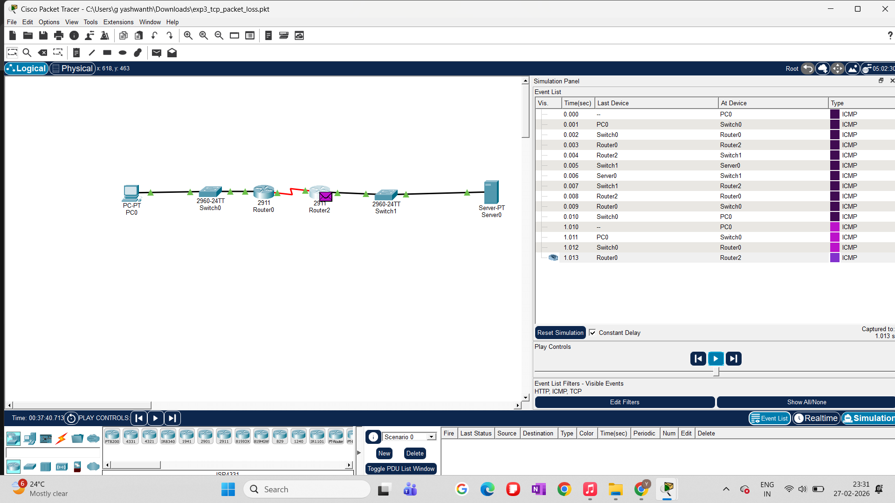
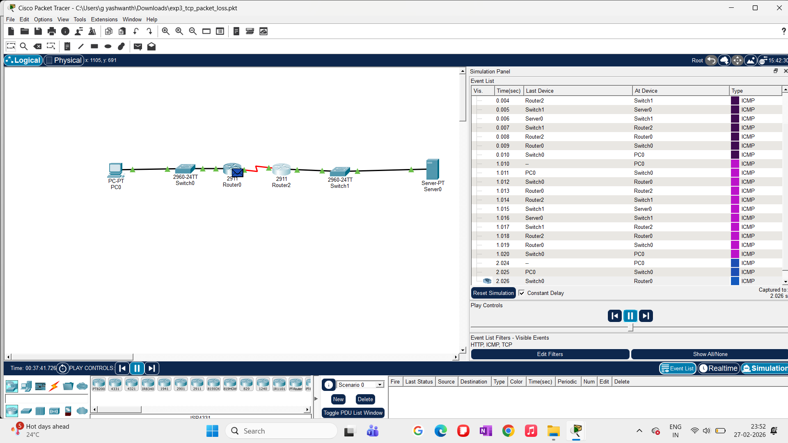

# Experiment 3: Impact of Packet Loss on TCP Performance

## Objective
The objective of this experiment is to study the effect of **packet loss** on TCP behavior, particularly focusing on how TCP reacts to lost packets through retransmissions, congestion control mechanisms, and performance degradation.

This experiment demonstrates how packet loss in an intermediate network device influences:
- End-to-end connectivity
- Packet delivery reliability
- TCP retransmission behavior
- Overall network performance

---

## Experimental Topology

The network consists of:
- One TCP client (PC0)
- Two intermediate routers (Router0 and Router2)
- One TCP server (Server0)
- Layer-2 switches at access segments

---

## Experimental Setup

- Simulation tool: **Cisco Packet Tracer**
- Protocols observed: **TCP, ICMP**
- Packet loss introduced by **manually disabling an interface** on an intermediate router
- Simulation mode enabled to capture packet-level events

---

## Procedure

### Step 1: Enable Simulation Mode
Simulation mode is enabled to observe packet traversal and protocol-level behavior.

---

### Step 2: Baseline Connectivity Test (No Packet Loss)
A ping operation is initiated from PC0 to Server0 to verify normal connectivity before inducing packet loss.

Observation:
- ICMP packets successfully reach the destination.
- Replies are received without delay or loss.

---

### Step 3: Inducing Packet Loss
Packet loss is introduced by **shutting down a serial interface** on Router0, simulating a link failure or congestion-induced packet drop.

---

### Step 4: Observing Packet Loss in Event List
The Simulation Event List shows packets being dropped at the intermediate router.

Observation:
- ICMP packets fail to reach the destination.
- No corresponding reply packets are generated.
- TCP packets experience transmission failure due to loss of connectivity.

---

### Step 5: Connectivity Failure Verification
A ping operation is repeated after packet loss is introduced.

Observation:
- Ping requests time out.
- Confirms end-to-end communication failure due to packet loss.

---

### Step 6: Interface Shutdown Confirmation
The interface responsible for packet loss is explicitly shown in shutdown state.

---

### Step 7: Restoring the Network
The previously disabled interface is re-enabled to restore connectivity.

---

### Step 8: Post-Recovery Connectivity Test
Ping is executed again after restoring the interface.

Observation:
- ICMP packets successfully reach the destination.
- Network connectivity is restored.

---

## Observations and Analysis

- Packet loss at an intermediate router causes **complete end-to-end communication failure**.
- TCP relies on retransmissions and acknowledgments; when packets are consistently dropped, TCP cannot establish or maintain reliable data transfer.
- Even temporary packet loss significantly impacts network performance.
- Restoring the failed link immediately recovers connectivity, highlighting TCP’s dependency on network stability.

---

## Conclusion

This experiment demonstrates that:
- Packet loss severely degrades TCP performance.
- Intermediate network devices play a critical role in reliable data delivery.
- TCP congestion control mechanisms are ineffective when packet loss persists due to link failure rather than congestion.

Understanding packet loss behavior is essential for designing robust and fault-tolerant networks.

---

## Files Used
- Packet Tracer topology file:  
  `topology/exp3_tcp_packet_loss.pkt`
