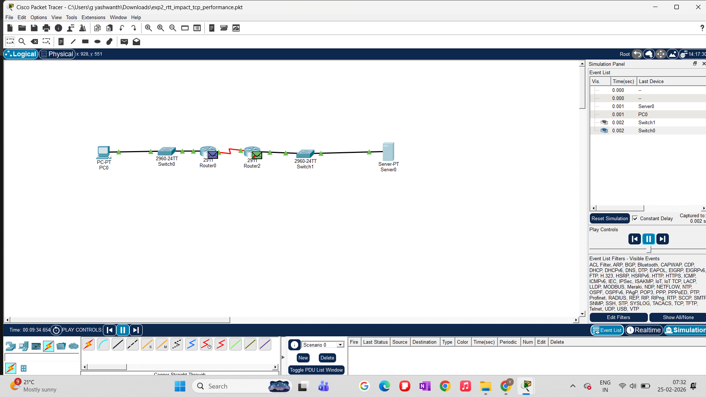
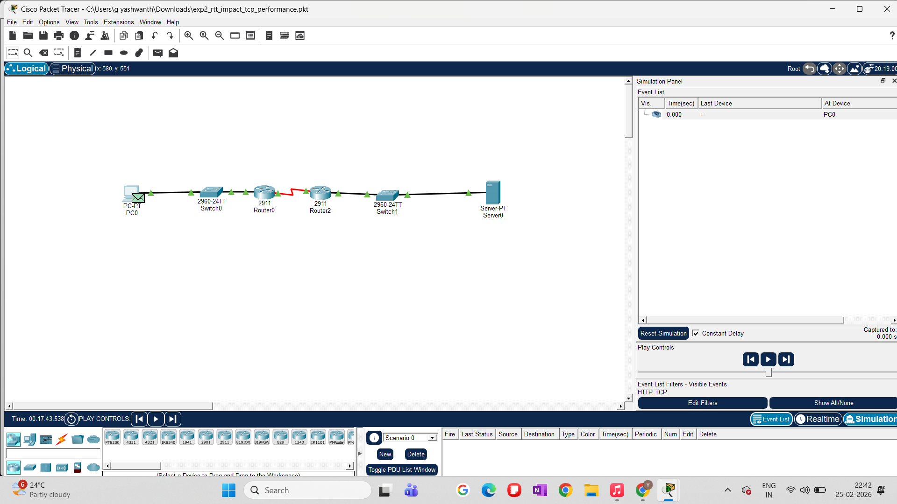
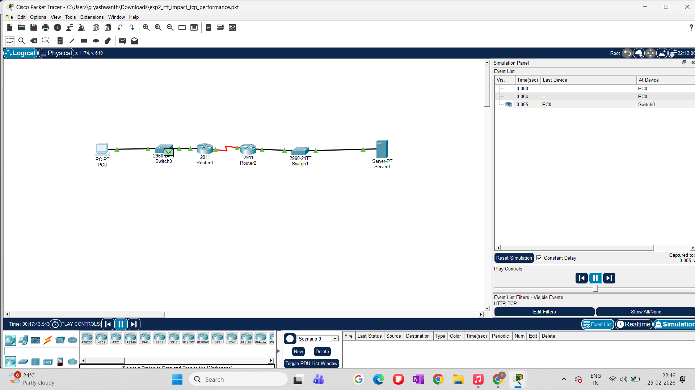
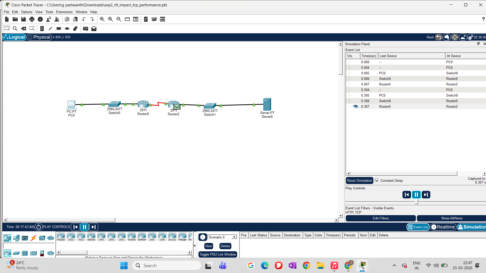
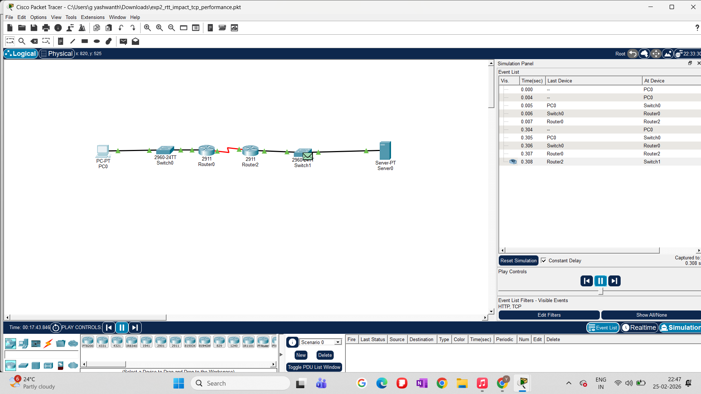
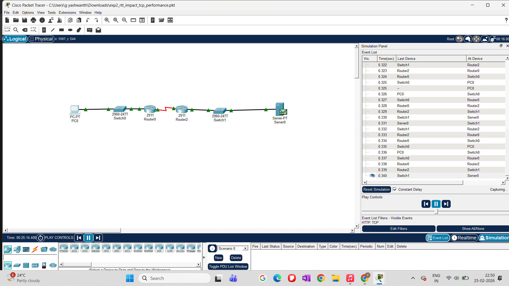

# RTT Impact on TCP Performance (Experiment 2)

## 1. Objective

The objective of this experiment is to study the **impact of Round-Trip Time (RTT)** on TCP behavior in a controlled network environment.  
RTT directly influences TCP performance by affecting acknowledgment delay, congestion window growth, and overall throughput.  

This experiment builds upon the baseline TCP experiment and introduces **multi-hop routing** to observe how increased RTT alters packet flow timing and TCP dynamics.

---

## 2. Experimental Setup

### Network Topology
- One client (PC)
- Two routers connected via a serial link
- One server
- End-to-end TCP communication observed using **Cisco Packet Tracer Simulation Mode**

The topology introduces additional propagation and processing delay, increasing the effective RTT between sender and receiver.

### Screenshot: Network Topology

---

## 3. Methodology

1. TCP traffic is initiated from the client (PC) toward the server.
2. Simulation Mode is enabled to capture packet-level events.
3. TCP segments are tracked hop-by-hop through:
   - Access switch
   - First router
   - Serial inter-router link
   - Second router
   - Destination server
4. Acknowledgment packets (ACKs) are traced on the return path.
5. Event List timestamps are used to analyze RTT behavior.

---

## 4. Observations

### 4.1 TCP Transmission Initiation
The TCP session begins at the client, where the first TCP segment is generated and forwarded toward the network.

---

### 4.2 Packet Traversal Through Intermediate Router
The TCP segment experiences processing and forwarding delay at the intermediate router, contributing to increased RTT.

---

### 4.3 Packet Arrival at Server
The TCP packet successfully reaches the server after traversing multiple hops, confirming correct routing and end-to-end connectivity.

---

### 4.4 TCP Acknowledgment Return Path
The server generates a TCP ACK, which traverses the same multi-hop path in reverse, further contributing to the total RTT.

---

### 4.5 RTT Measurement Using Event List
The Simulation Event List reveals the timestamp gap between TCP data transmission and ACK reception.  
This gap represents the **effective RTT**, which is noticeably higher compared to the baseline experiment.

---

## 5. Analysis

- Increased RTT delays TCP acknowledgments, slowing congestion window growth.
- Even without packet loss, higher RTT reduces TCP efficiency.
- Multi-hop routing amplifies propagation and queuing delays.
- TCP performance degradation can occur **purely due to delay**, independent of congestion or loss.

This experiment demonstrates why RTT is a critical parameter in TCP congestion control algorithms.

---

## 6. Key Insights

- RTT directly affects TCP throughput and responsiveness.
- Delay-based effects must be considered alongside packet loss in congestion analysis.
- TCP behavior in real networks is heavily influenced by path length and routing complexity.

---

## 7. Conclusion

This experiment confirms that **RTT is a fundamental limiting factor** in TCP performance.  
By introducing additional routing hops, TCP acknowledgment latency increases, impacting flow control even under ideal (lossless) conditions.

These findings motivate further experiments involving:
- Artificial delay injection
- Packet loss
- Fairness across competing TCP flows

---

## 8. Files Used

- Packet Tracer file: `exp2_rtt_impact_tcp_performance.pkt`
- Screenshots stored in: `screenshots/`

---

## 9. Next Steps

- Experiment 3: Impact of Packet Loss on TCP
- Experiment 4: TCP Fairness Analysis
- Comparative study of delay vs loss effects on congestion control
